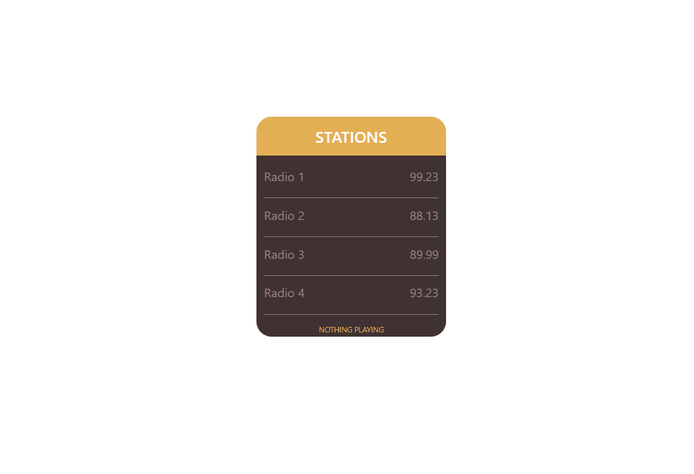

# Radio App Coding Challenge

There is some missing codes in the application. Complete the codes and fix the app. When user click any channel , radio image should be seen at channel part and channel name should be seen at footer currently playing part. When user click same or any other channel new channel should be opened and previous one should be closed.

## Expected Outcome

